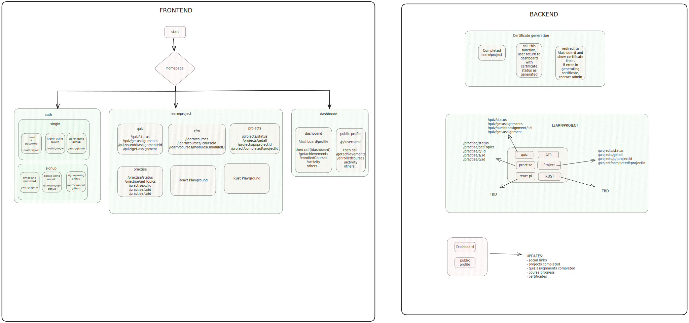

# OpenEdu

## Project Detail

This is a project detail for OpenEdu Learning Platform. The project is currently in the planning / Initial Development phase. The project is expected to start in December 2023 and end in May 2024. The project is divided into three phases. The first phase is expected to start in December 2023 and end in January 2024. The second phase is expected to start in January 2024 and end in February 2024. The third phase is expected to start in February 2024 and end in May 2024

## Table of Contents

- [OpenEdu Learning Platform Project Detail](#openedu-learning-platform-project-detail)
  - [Table of Contents](#table-of-contents)
  - [**Project Details**](#project-details)
    - [**Target Audience:**](#target-audience)
    - [**Technology Stack:**](#technology-stack)
    - [**Vision:**](#vision)
    - [**Impact:**](#impact)
    - [**Objective:**](#objective)
  - [**Products:**](#products)
  - [**Roadmap:**](#roadmap)
  - [**Key Features:**](#key-features)

### **Objective:**

OpenEdu aims to revolutionize tech education by providing free, accessible, and project-based learning resources. The project seeks to bridge the gap in quality educational materials, fostering a community-driven approach to democratize technology education.

### **Target Audience:**

OpenEdu is designed for anyone who wants to learn about technology, irrespective of their background or financial status. The platform is especially beneficial for those who face financial barriers to education, as it provides free, accessible, and high-quality learning resources.

### **Technology Stack:**

1.  **Frontend:** NextJS, Tailwindcss, Shadcn-UI, Docker
2.  **Backend:** NestJS, Prisma, PostgreSQL, Redis, MongoDB, Docker
3.  **AI:** Python, LLM, Retrieval Augmented Generation (RAG), vector dB, langchain, transformers, Docker
4.  **Deployment:** TBD
5.  **IOS:** Swift
6.  **Android:** Kotlin

### **Vision:**

OpenEdu envisions a future where technology education is inclusive, irrespective of financial constraints. By providing a platform that combines open-source resources, project-based learning, and personalized guidance, OpenEdu seeks to empower learners globally.

### **Impact:**

The project aims to make a substantial impact on the accessibility of quality tech education, especially for those who face financial barriers. By encouraging collaboration and participation, OpenEdu strives to create a supportive community where learners can thrive and contribute to the advancement of technology.

### **Products:**

- [x] Authentication (signin, signup, email verification)
- [ ] Authorization (forgot password, reset password, JWT)
- [x] User profile (dashboard, public profile)
- [x] Course catalog
- [x] Course content
- [x] Course progress
- [x] Course completion
- [ ] Course certificate
- [ ] Course rating
- [ ] Course review

- [AI Tutor](AITutor.md)

  - [x] Setup Google AI [Gemini model](https://blog.google/technology/ai/google-gemini-ai/)
  - [ ] Develop EduAI
    - [ ] Choose LLM
    - [ ] Fill vector dB
    - [ ] Implement Retrieval Augmented Generation (RAG) [Research Paper](https://arxiv.org/abs/2005.11401)
    - [ ] Implement langchain, transformers
    - [ ] Test and deploy using Docker
    - [ ] Continuous improvement

- [React Playground](ReactPlayground.md)

  - [ ] React materials to learn
  - [ ] React questions to practice
  - [ ] React project building guide

- [Rust Playground](RustPlayground.md)

  - [ ] Rust materials to learn
  - [ ] Rust questions to practice
  - [ ] Rust project building guide

- [ProjectX](ProjectX.md)
  - [ ] Project catalog
  - [ ] Project content
  - [ ] Project progress
  - [ ] Contribution to Open Source
  - [ ] Project-based learning

### **Roadmap:**

- [ ] **Phase 1: Dec 2023 - Jan 2024 (Deadline: 24 Jan 2024)**

  - [x] **Phase 1.1:** Develop a web application for user profiles, course catalog, and content access, progression tracking.
  - [x] **Phase 1.2:** Enable Chat with Gemini AI, generate certificates.
  - [ ] **Phase 1.3:** Implement automated testing, provide learning assessments.
  - [ ] **Phase 1.4:** Initial demo launch of ProjectX with full-stack websites, open-source contributions, and project-based learning.
  - [ ] **Phase 1.5:** Start work on Android and IOS apps.

- [ ] **Phase 2: Jan 2024 - Feb 2024 (Deadline: 28 Feb 2024)**

  - [ ] **Phase 2.1:** Commence custom RAG model training and testing.
  - [ ] **Phase 2.2:** Initial launch of React Playground, Rust Playground.
  - [ ] **Phase 2.3:** launch Android and IOS apps.

- [ ] **Phase 3: Jan 2024 - May 2024 (Deadline: 5 May 2024)**
  - [ ] **Phase 3.1:** Launch ProjectX with full-stack websites, open-source contributions, and project-based learning.
  - [ ] **Phase 3.2:** Transition to EduAI for an enhanced learning experience.

### **Key Features:**

- [x] **Open Source Learning:** Leverage the power of open-source materials to ensure that quality education is freely accessible to all.
- [x] **Project-Based Learning:** Prioritize a hands-on, project-centric approach, allowing users to apply theoretical knowledge in real-world scenarios.
- [x] **Personal AI Tutor:** Each learner benefits from a personalized AI tutor, offering tailored guidance and support throughout their educational journey.
- [x] **Community Collaboration:** Actively collaborate with organizations like Tublian and engage in events like Hacktoberfest, fostering a sense of community and collective knowledge-sharing.
- [x] **Learning Assessment:** Provide regular assessments to track progress and identify areas for improvement.
- [x] **Learning Certificates:** Provide certificates upon course completion, allowing learners to showcase their skills and knowledge.
- [x] **Learning Support:** Provide a dedicated support team to assist learners with any queries or concerns.
